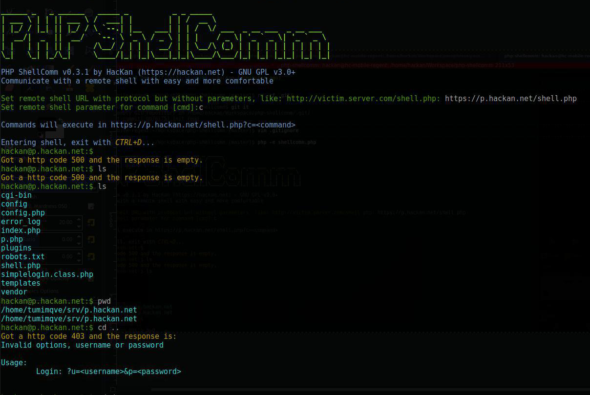

# ShellComm

**ShellComm** is a simple interactive CLI remote shell communicator. Sometimes, during a pentest, you get to upload a shell but you can't upload a heavy, complex one for whatever reason. In those situations, you can simply upload the tinyest shell like `<?php echo system($_GET['cmd']);` and use this tool to comfortably communicate with it.

It handles command encoding, http error codes, has cool colours and is very simple. You can also use the [tiny](shellcomm-tiny.php) version, which is a single file with the same functionalities, if you feel more comfortable with that.

Do note that, for the moment, it communicates via GET requests, which are surely being logged at the server. Improvements are welcome, which include:

* Using other methods besides GET, like POST or HEAD maybe.
* Encrypting sent command.

## Usage

Download a [release](https://github.com/HacKanCuBa/shellcomm-php/releases/latest), veirfy its signature and run `php shellcomm.php`, or at your preference, `php shellcomm-tiny.php`. Run it at your local machine, *not* at the remote one!.

## Requirements

* PHP 5.4+

Note: it has been tested only in Linux (Debian 9).

## Disclaimer

I'm not to be held responsible for whatever usage you give to this tool.  
Also, I sacrifice some programmatic things, like using Composer, to keep it somewhat simple.

### FAQ

#### Can I hack *X* with this?

No, you can't. This is just a tool to establish communications with a shell. How and where to get one is up to you.

#### Should I upload this to the remote server?

No, this is *not* a shell, just a tool to establish communications with a shell. Use it at your local machine.

#### Does it execute automatic exploits or stuff like that?

No, it does absolutely nothing besides sending the command directly to the remote shell. Use your brains, skills and other tools.

## License

**ShellComm** is made by [HacKan](https://hackan.net) under GNU GPL v3.0+. You are free to use, share, modify and share modifications under the terms of that [license](LICENSE).

    Copyright (C) 2017 HacKan (https://hackan.net)

    This program is free software: you can redistribute it and/or modify
    it under the terms of the GNU General Public License as published by
    the Free Software Foundation, either version 3 of the License, or
    (at your option) any later version.

    This program is distributed in the hope that it will be useful,
    but WITHOUT ANY WARRANTY; without even the implied warranty of
    MERCHANTABILITY or FITNESS FOR A PARTICULAR PURPOSE.  See the
    GNU General Public License for more details.

    You should have received a copy of the GNU General Public License
    along with this program.  If not, see <http://www.gnu.org/licenses/>.

**ShellComm** uses [Colors](https://github.com/kevinlebrun/colors.php) by @kevinlebrun under MIT license.
